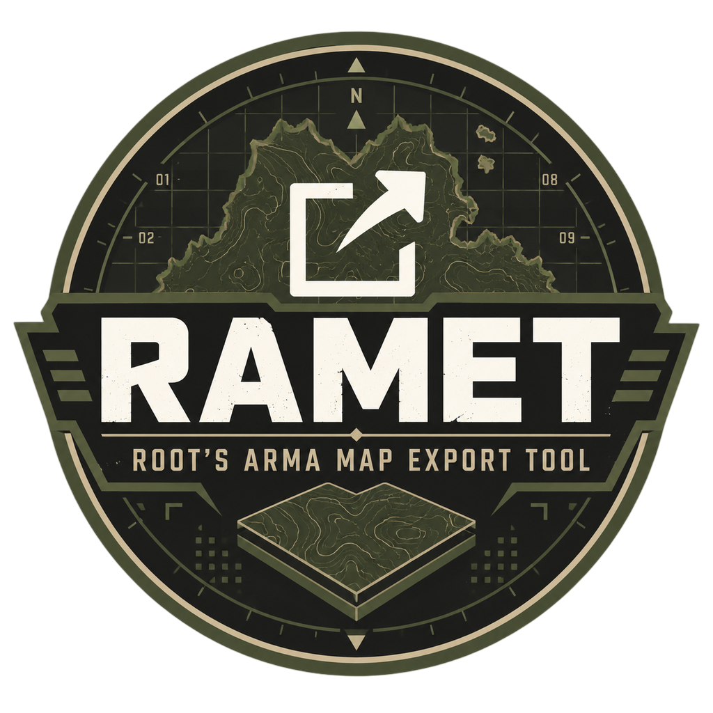

# RAMET

<p align="center">
  
</p>

<p align="center">
<!-- RAMET-RELEASE-BADGE:START -->
 
<!-- RAMET-RELEASE-BADGE:END -->
</p>

**Root's Arma Map Export Tool** — export Arma 3 terrains into raster and vector tile sets that can be used by a web map planner.

This is a tool pipeline, not a gameplay mod. You select one or more Arma 3 terrains, RAMET captures their data, and a later Docker step transforms that data into finished map tiles.

## IMPORTANT INFORMATION

Four conditions must be met for an export to work:

1. `@root_amet` is installed in the Arma 3 installation folder.
2. `@CBA_A3` is installed and loaded with RAMET.
3. **FlatDevil is available.** The file `flatdevil_x64.dll` must be in the Arma 3 installation folder, next to `arma3_x64.exe`. A Python 3.7+ installation must also be on `PATH`. Get FlatDevil from the [FlatDevil repository](https://github.com/A3-Root/FlatDevil).
4. **The terrain you want to export is installed and enabled.** Subscribe to or install the terrain mod, then enable it in the Arma 3 launcher along with RAMET and CBA. RAMET cannot export a terrain that Arma has not loaded. The terrain's class name is required to be used in a batch queue. For example, the displayed name `Altis` uses the class name `altis`. Not all map names use their display names so be extra careful.

If any of these are missing, the terrain may not show in the RAMET picker, the exporter may fail to start, or FlatDevil calls may silently fail.

## Quick start

This is the easiest path for a typical Windows user with a release zip.

### 1. Install the files

1. Locate your Arma 3 installation folder. In Steam, right-click **Arma 3 → Manage → Browse local files**. It's the folder containing `arma3_x64.exe`.
2. Unzip the release into that folder. You should see an `@root_amet` folder, not an extra nested folder like `@root_amet\root_amet`.
3. Place `flatdevil_x64.dll` directly in the Arma 3 installation folder. Do not place it inside `@root_amet`.
4. Install or subscribe to [CBA_A3](https://steamcommunity.com/workshop/filedetails/?id=450814997).
5. Install or subscribe to the terrain you want to export. In the Arma 3 launcher, enable:
   - `@root_amet`
   - `@CBA_A3`
   - the terrain mods and any required dependencies

Keep the terrain enabled for the entire export. If you plan to export multiple terrains, enable all of them before starting RAMET.

### 2. Choose the Arma branch

Use the **main/stable Arma 3 branch** for:

- `RAMET — Grad_meh export` for standard satellite and vector export
- `RAMET — In-Game export (GMS)` for in-game aerial export

Use the **Arma 3 diagnostic/development branch** for:

- `RAMET — OCAP export (diag)` for the high-resolution OCAP RenderTerrain path

You do not need the diagnostic branch for a standard Grad_meh export. Steam may refer to the diagnostic version as a beta branch; switch branches only when needed for OCAP. Allow Steam to finish updating before launching.

### 3. Start an interactive export

1. Launch Arma 3 with RAMET, CBA, and the target terrain enabled.
2. On the main menu, open the RAMET spotlight/menu entry. If the menu isn’t visible, check the troubleshooting section below.
3. Choose one of the following:
   - **RAMET — Grad_meh export** on the stable branch
   - **RAMET — In-Game export (GMS)** on the stable branch
   - **RAMET — OCAP export (diag)** on the diagnostic branch
4. Select the terrain(s) in the picker. Only terrains currently known to Arma can be selected.
5. Start the export and wait for it to finish. Large terrains can take a long time. Do not close Arma or disable the terrain mod while an export is running.

The raw output is saved in the Arma 3 folder. Common locations are `grad_meh\{world}\`, `ocap_exporter\{world}\`, and `ingame\{world}\`.

### 4. Turn the raw export into finished tiles

First, install and start [Docker Desktop](https://www.docker.com/products/docker-desktop/). Then execute / run the `@root_amet\batch\03_postprocess.bat` file.

This creates the post-processing image, merges the available export data, generates PMTiles and raster tiles, processes SVG layers, optimizes the images, and verifies the result. Docker must be running; All required packages and dependencies for this step is handled by docker.

The finished output is placed at:

```text
Arma 3\ramet_output\{world}\
```

At this point, the export is complete. To copy it into a local planner, specify the planner's `map_tiles` folder either by editing and executing/running the `@root_amet\batch\04_deploy.bat` file or passing the `--planner-root` flag:

```bat
@root_amet\batch\04_deploy.bat --planner-root "C:\path\to\your\planner\map_tiles"
```

To create uploadable archives instead, run `@root_amet\batch\05_zip_for_upload.bat` (or add `--bundle` for a combined archive). Zips are saved in `ramet_output\_zips\`.

## Exporting several terrains automatically

For a repeatable long, hands-free queue, open `@root_amet\batch\worlds.txt` in a text editor and add one exact Arma `CfgWorlds` class name per line:

```text
altis
stratis
my_custom_world
```

Blank lines and lines starting with `#` are ignored. The names must be class names, not necessarily the names shown in the launcher or on the map. If a name is incorrect, that world will not export. The terrain mods for every listed world must be installed and enabled in the launcher.

On the **stable branch**, double-click:

```text
@root_amet\batch\01_export_grad_meh.bat
```

On the **diagnostic branch**, double-click:

```text
@root_amet\batch\02_export_ocap.bat
```

These scripts launch the correct Arma executable and process the queue using FlatDevil. They can resume after crashes or restarts. The first script starts a fresh Grad_meh queue; the OCAP queue retains its stage state. Check `ramet_state\ramet_bulk.log` for progress and completion. After the export stage, run `03_postprocess.bat`.

`batch\render_worlds.txt` controls which worlds the OCAP Docker renderer and post-processing step handle. Leave it empty to process every discovered world, or list one class name per line to limit the run.

## Which export should I use?

| Export | Arma branch | Best for | Entry point |
| --- | --- | --- | --- |
| Grad_meh | Stable/main | The typical satellite and vector map workflow | RAMET spotlight or `01_export_grad_meh.bat` |
| OCAP RenderTerrain | Diagnostic | High-resolution OCAP terrain tile pyramids | RAMET spotlight or `02_export_ocap.bat` |
| In-Game/GMS | Stable/main | Aerial imagery captured through the game | RAMET spotlight |

You can run multiple exporters for the same world. Post-processing includes all valid source folders that exist and only displays layers that were actually produced.

## Common problems

### RAMET does not appear in the launcher or menu

Confirm that `@root_amet` is in the Arma 3 installation folder and enabled in the launcher. Make sure `@CBA_A3` is also enabled. If you built RAMET yourself, ensure the build produced a release zip and that you extracted the zip, not the source folder.

### FlatDevil errors, missing Python calls, or the queue does not advance

Check that:

- `flatdevil_x64.dll` is next to `arma3_x64.exe`, not inside `@root_amet`.
- Python 3.7 or newer is installed and `python --version` works in a new terminal.
- `@root_amet` is loaded.
- Arma was restarted after installing or moving the DLL.

### The terrain is not in the picker

Install and enable the terrain mod and its dependencies in the launcher. Restart Arma after changing mods. RAMET reads Arma's loaded `CfgWorldList`; an uninstalled or disabled terrain cannot be selected.

### OCAP says that `diag_exportTerrainSVG` is missing

You launched the stable executable. Switch Steam to the Arma 3 diagnostic/development branch and start `arma3diag_x64.exe` through the diagnostic launcher or `02_export_ocap.bat`.

### Post-processing fails

Start Docker Desktop and wait until it reports that Docker is running. Then try again. To rerun only the RAMET merge/optimization after OCAP data has already been rendered, use:

```bat
@root_amet\batch\03_postprocess.bat --skip-ocap
```

### A batch script says that an executable is missing

The scripts should be inside `Arma 3\@root_amet\batch\`. They look for Arma by going two folders upward. Do not move the `batch` folder outside `@root_amet`. `01_export_grad_meh.bat` needs `arma3_64.exe`; `02_export_ocap.bat` needs `arma3diag_x64.exe`.

## Building from source

Most users should use a release zip and skip this section. Developers rebuilding RAMET should use `release.ps1` on Windows or `release.sh` on Linux/WSL. HEMTT is required and must be on `PATH`.

Windows is the fully supported build and export platform. The complete Windows build needs HEMTT, Docker, Visual Studio 2022 with Desktop C++, the Windows SDK, .NET 10 SDK, Conan 2, CMake, Ninja, Rust, Go, a Windows MinGW-w64/MSYS2 `gcc`, and Python 3.10 or newer. Linux/WSL can build the OCAP DLL and run post-processing, deploy, and zip. However, the Grad_meh and GMS native DLLs require Windows tools. For a source checkout with existing native binaries, `release.ps1 -SkipSubprojects` or `./release.sh --skip-subprojects` can package the mod without rebuilding them.

When `release.ps1` starts, it refreshes `PATH` and checks common installation locations before reporting a tool as missing. If Docker Desktop is installed but stopped, the script starts it and waits for the daemon. For supported tools, it offers to install them with `winget`; MSYS2 can install the MinGW-w64 GCC package needed by the OCAP Go/cgo build. HEMTT and Visual Studio still need user-directed installation when they are not found. The script reruns its checks after these repairs.

## Project documentation

- [`docs/BULK_EXPORT.md`](docs/BULK_EXPORT.md) — detailed batch-export runbook
- [`docs/SCHEMA.md`](docs/SCHEMA.md) — `map.json` and output schema
- [`subprojects/ocap-renderterrain/README.md`](subprojects/ocap-renderterrain/README.md) — OCAP-specific background

## License

[APL-SA](LICENSE) (Arma Public License Share Alike) — see [`LICENSE`](LICENSE) for the full license and third-party notices.
